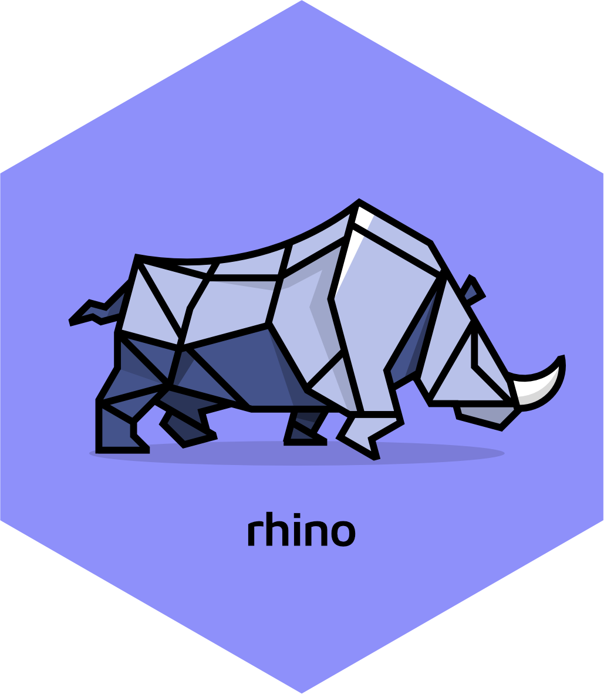

# Rhino <a href="https://appsilon.github.io/rhino/"></a>
> _Build high quality, enterprise-grade [Shiny](https://shiny.rstudio.com/) apps at speed._

<!-- badges: start -->
[](https://cran.r-project.org/package=rhino)
[](https://github.com/Appsilon/rhino/actions/workflows/ci.yml)
[](https://CRAN.R-project.org/package=rhino)
[](https://CRAN.R-project.org/package=rhino)
[](https://opensource.org/licenses/LGPL-3.0)
<!--
[](https://codecov.io/gh/Appsilon/rhino) 
-->
<!-- badges: end -->

## Events

### Upcoming

Would you like to learn about Rhino hands-on? Join our events!
Upcoming events will be added to this section - stay tuned.

### Past

* [**Creating Shiny Apps with Rhino: the new framework for Shiny apps**](https://www.youtube.com/watch?v=8H_ZHUy8Yj4)<br>
2022-05-13 at 18:00 (UTC+2)<br>
Online workshop led by [Kamil Żyła](https://www.linkedin.com/in/kamil-zyla/)

* [**Introducing Rhino: Shiny application framework for enterprise**](https://www.rstudio.com/conference/2022/talks/introducing-rhino-shiny-application-framework/)<br>
2022-07-28 at 15:20 (UTC-4)<br>
Talk given by [Kamil Żyła](https://www.linkedin.com/in/kamil-zyla/)
at [rstudio::conf(2022)](https://www.rstudio.com/conference/2022/2022-conf-talks/)

* **Enterprise-grade Shiny App Development with {rhino}**<br>
2022-08-23 at 11:00 (UTC-4)<br>
Workshop led by [Jakub Nowicki](https://www.linkedin.com/in/jakub-nowicki/)
at [R/Medicine 2022](https://events.linuxfoundation.org/r-medicine/)

* **Introducing Rhino: Shiny application framework for enterprise**<br>
2022-09-07 at 11:30 (UTC+1)<br>
Talk given by [Jakub Nowicki](https://www.linkedin.com/in/jakub-nowicki/)
at [EARL 2022](https://www.ascent.io/earl)

* **Rhino Workshop**<br>
2022-10-11 at 19:00 (UTC+2)<br>
Led by [Kamil Żyła](https://www.linkedin.com/in/kamil-zyla/)
at [LatinR 2022](https://latin-r.com/en)

## Why Rhino?

Rhino allows you to create Shiny apps **The Appsilon Way**  - like a fullstack software engineer. Apply best software engineering practices, modularize your code, test it well, make UI beautiful, and think about user adoption from the very beginning. Rhino is an opinionated framework with a focus on software engineering practices and development tools.

Rhino supports your work in 3 main areas:

1. **Clear code**: scalable app architecture, modularization based on Box and Shiny modules.
2. **Quality**: unit tests, E2E tests with Cypress, logging and monitoring, linting.
3. **Automation**: project startup, CI with GitHub Actions, dependency management with renv,
configuration management with config, Sass and JavaScript bundling with ES6 support via Node.js.

These features are often implemented using well-known packages.
Rhino brings them all working together out of the box!

Read more:
[What is Rhino?](https://appsilon.github.io/rhino/articles/explanation/what-is-rhino.html)

## Installation

Stable version:
```r
install.packages("rhino")
```

Development version:
```r
remotes::install_github("Appsilon/rhino")
```

## Documentation

[Rhino documentation](https://appsilon.github.io/rhino/) is divided into four sections,
accessible from the navigation bar at the top:

1. [**Tutorial**](https://appsilon.github.io/rhino/articles/tutorial/create-your-first-rhino-app.html):
Start here to learn the basics.
2. **Explanation**:
In-depth articles on Rhino machinery and its design.
3. **How-to Guides**:
Step-by-step instructions for common tasks.
4. **Reference**:
A list of Rhino functions with technical details.

Check out our [Rhino Showcase](https://github.com/Appsilon/rhino-showcase),
an example Shiny application built using Rhino.

You can also learn about Rhino by watching the video from one of our workshops:
[Creating Shiny Apps with Rhino: the new framework for Shiny apps](https://www.youtube.com/watch?v=8H_ZHUy8Yj4).
A repository with step-by-step commits for the workshop application can be found
[here](https://github.com/Appsilon/rhino-workshop/tree/workshop-2022-05-13).

---

Developed with :heart: at [Appsilon](https://appsilon.com).
Get in touch: <opensource@appsilon.com>.

Appsilon is a
[**Full Service Certified RStudio Partner**](https://www.rstudio.com/certified-partners/).

<a href="https://appsilon.com/careers/">
  
</a>
