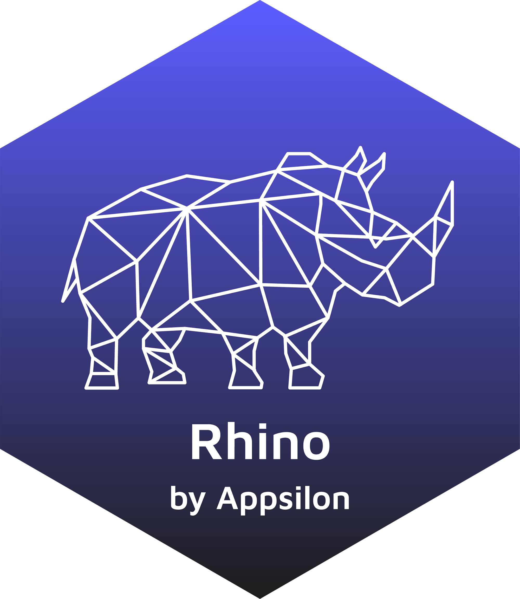

# Rhino [](https://appsilon.github.io/rhino/)

> *Build high quality, enterprise-grade
> [Shiny](https://shiny.rstudio.com/) apps at speed.*

## Why Rhino?

Rhino allows you to create Shiny apps **The Appsilon Way** - like a
fullstack software engineer. Apply best software engineering practices,
modularize your code, test it well, make UI beautiful, and think about
user adoption from the very beginning. Rhino is an opinionated framework
with a focus on software engineering practices and development tools.

Rhino supports your work in 3 main areas:

1.  **Clear code**: scalable app architecture, modularization based on
    Box and Shiny modules.
2.  **Quality**: unit tests, E2E tests with Cypress, logging and
    monitoring, linting.
3.  **Automation**: project startup, CI with GitHub Actions, dependency
    management with renv, configuration management with config, Sass and
    JavaScript bundling with ES6 support via Node.js.

These features are often implemented using well-known packages. Rhino
brings them all working together out of the box!

Read more: [What is
Rhino?](https://appsilon.github.io/rhino/articles/explanation/what-is-rhino.html)
and [Similar
projects](https://appsilon.github.io/rhino/articles/explanation/similar-projects.html).

## Get it

Stable version:

``` r
install.packages("rhino")
```

Development version:

``` r
remotes::install_github("Appsilon/rhino")
```

## Usage

- Create a new Rhino application with
  [`rhino::init()`](https://appsilon.github.io/rhino/v1.0.0/reference/init.md)
- To learn more, follow the [Rhino
  tutorial](https://appsilon.github.io/rhino/articles/tutorial/create-your-first-rhino-app.html)
- To migrate an existing application to Rhino, refer to [`rhino::init()`
  details
  section](https://appsilon.github.io/rhino/reference/init.html#details-1)

## About

Rhino is distributed under [LGPL-3.0
license](https://opensource.org/licenses/LGPL-3.0). Developed with ❤️ at
[Appsilon](https://appsilon.com).

------------------------------------------------------------------------

Appsilon is the **Full Service Certified RStudio Partner**. Learn more
at [appsilon.com](https://appsilon.com).

Get in touch: <opensource@appsilon.com>.

[](https://appsilon.com/careers/)
