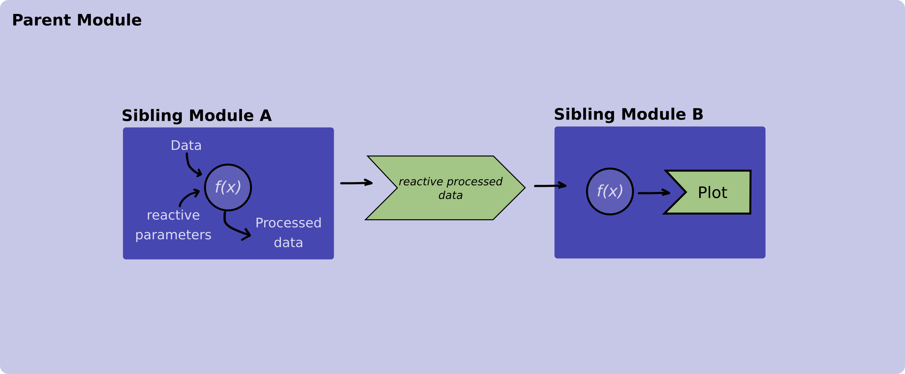
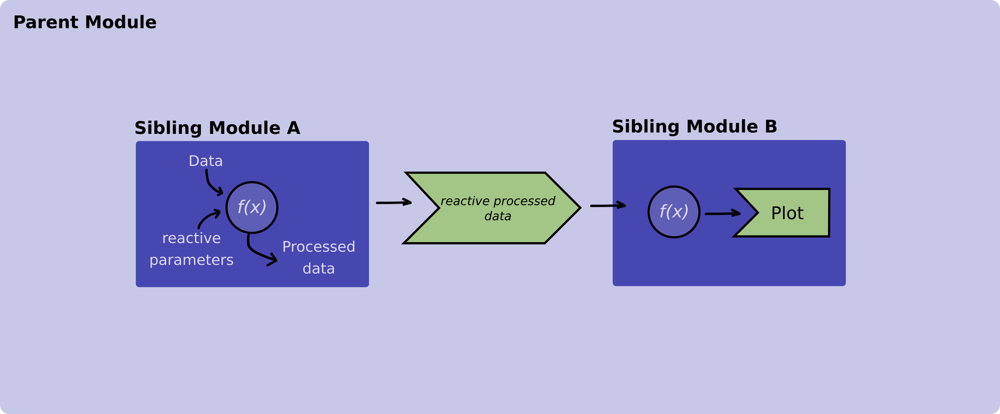

## Introduction
State management is a topic that comes along very often when it comes to reactive programming.

As the application grows in size and becomes more intricate, it's common to find an increasing number of
[Shiny modules](https://shiny.posit.co/r/articles/improve/modules/) distributed across various levels of depth.
This results in the necessity to share information, particularly the application's state, among these diverse Shiny modules.

While there are many ways to approach this problem here we are going to present two examples.
In the first example we are going to pass information (reactive objects) from a parent module to a child module and
in the second example we are going to pass information between two sibling modules.

## Examples

### Example 1 - Communicating between a parent module and its children modules
In this example we are going to have two modules. The parent module will load and process data using filters and will
pass it down to the child module that will display a table for this processed data.


<font size="2">
**Figure 1. Diagram illustrating how a reactive value is passed between a parent and its child module.**
</font>

Now, let's explore how the code will look like:

Let's start with the table module. Remember from the Figure 1 that this module receives a reactive object with the data
to display from its parent module.

```R
box::use(
  shiny[div, moduleServer, NS, renderTable, req, tableOutput],
)

#' @export
ui <- function(id) {
  ns <- NS(id)
  div(
    tableOutput(
      outputId = ns("table")
    )
  )
}

#' @params id The Id of this shiny module
#' @params table_data A reactive that contains that the data that will be
#' displayed in the table.
#' @export
server <- function(id, table_data) {
  moduleServer(id, function(input, output, session) {

    output$table <- renderTable({
      req(table_data())
      table_data()
    })

  })
}

```

And continue with the usage of the table module within its parent module.

```R
# Parent Module
box::use(
  shiny[
    div, moduleServer, NS, reactive, req, selectInput
  ],
)

box::use(
  table_module = app/view/table_module.R,
  utils = utils/utils.R # This module is not defined in this example
)

#' @export
ui <- function(id) {
  ns <- NS(id)
  div(
    selectInput(
      inputId = ns("filters"),
      label = "Select filters",
      choices = c("Parameter A", "Parameter B", "Parameter C")
    ),
    table_module$ui(ns("table_module"))
  )
}

#' @export
server <- function(id) {
  moduleServer(id, function(input, output, session) {
    input_data <- utils$read_data_from_database()

    # Define a reactive to pass down the table module
    processed_data <- reactive({
      process_data(input_data, input$filters)
    })

    # Initialize the table module server function
    table_module$server(id = "table_module", table_data = processed_data)
  })
}
```
<font size="2">
`r shiny::icon("warning", class = "text-warning")` Both `read_data_from_database` and `process_data` imported from the
`utils.R ` module are mocked functions that we are using for the purpose of aiding the example. These functions are not
defined in this example code.
</font>

### Example 2 - Communicating between two sibling modules

Suppose we have a data processing module and a plotting module, both functioning as siblings, with their respective roles
being to process and exhibit data in a given plot. These sibling modules are nested within another module, which we've
denoted as `main.R` which is our main module within a Rhino app.


<font size="2">
**Figure 2. Diagram illustrating how a reactive value is passed between sibling modules.**
</font>

Let's explore how the code of these modules should look like:

```R
# processing_data_module.R
box::use(
  shiny[
    div, moduleServer, NS, reactive, req, selectInput
  ],
)

box::use(
  utils = utils/utils.R # This module is not defined in this example
)

#' @export
ui <- function(id) {
  ns <- NS(id)
  div(
    selectInput(
      inputId = ns("parameter"),
      label = Select a parameter,
      choices = c("alfa", "beta", "gamma")
    )
  )
}

#' @export
server <- function(id) {
  moduleServer(id, function(input, output, session) {
    example_data <- utils$read_data_from_database()

    reactive({
      utils$process_data(example_data, input$parameter)
    })
  })
}
```
<font size="2">
`r shiny::icon("warning", class = "text-warning")` Both `read_data_from_database` and `process_data` imported from the
`utils.R ` module are mocked functions that we are using for the purpose of aiding the example. These functions are not
defined in this example code.
</font>

And the plotting module:

```R
# plotting_module.R
box::use(
  shiny[div, moduleServer, NS, plotOutput, renderPlot, req],
  graphics[plot],
)


#' @params id Id of the module
#' @export
ui <- function(id) {
  ns <- NS(id)
  div(
    plotOutput(
      inputId = ns("plot")
    )
  )
)

#' @params id Id of the module
#' @params data_to_display A reactive that contains that the data that will be
#' plotted
#' @export
server <- function(id, data_to_display) {
  moduleServer(id, function(input, output, session) {

    output$plot <- renderPlot({
      req(data_to_display)
      plot(data_to_display())
    })

  })
}
```

After we have our sibling modules ready we use them in our `main.R` function.
Pay special attention to the server function in which we save the output of the data processing module in a variable and
we pass it down to the plot module.

```R
box::use(
  shiny[bootstrapPage, div, moduleServer, NS],
)

box::use(
  data_module = app/view/processing_data_module,
  plot_module = app/view/plotting_module
)


#' @export
ui <- function(id) {
  ns <- NS(id)
  bootstrapPage(
    div(
      data_module(ns("data_module"))
    ),
    div(
      plot_module$ui(ns("plot_module"))
    )
  )
}

#' @export
server <- function(id) {
  moduleServer(id, function(input, output, session) {
    # Saving the output of the data_module
    data_to_display <- data_module$server("data_module")
    # Passing `data_to_display` to the sibling module
    plot_module$server("plot_module", data_to_display)
  })
}
```

To sum up, in the aforementioned example, the data processing module returns a reactive
that holds the processed data. Subsequently, this reactive is passed down
to the server function of the plotting module. The plotting module utilizes this
specific reactive, containing the processed data, to create visualizations.
