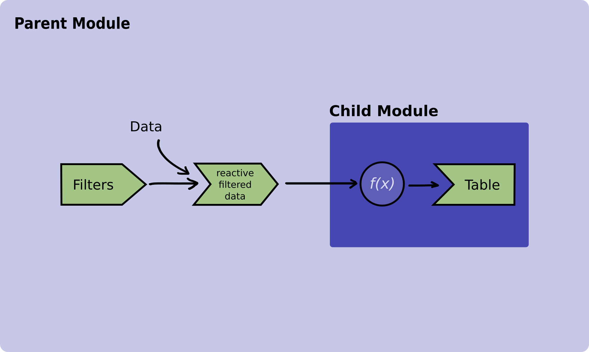

State management is a topic that comes along very often when it comes to reactive programming. 

As the application grows in size and becomes more intricate, it's common to find an increasing number of 
[Shiny modules](https://shiny.posit.co/r/articles/improve/modules/) distributed across various levels of depth.
This results in the necessity to share information, particularly the application's state, among these diverse Shiny modules.

While there are many ways to approach this problem here (Figure 1) we are going to present one that consists in passing reactive 
values between two sibling modules.

Suppose we have a data processing module and a plotting module, both functioning as siblings, with their respective roles
being to process and exhibit data in a given plot. These sibling modules are nested within another module, which we've
denoted as `main.R` which is our main module within a Rhino app.



Let's explore how the code of these modules should look like:

```R
# processing_data_module.R

#' @export
ui <- function(id) {
  ns <- NS(id)
  div(
    selectInput(
      inputId = ns("parameter"),
      label = Select a parameter,
      choices = c("alfa", "beta", "gamma")
    )
  )
)

#' @export
server <- function(id) {
  moduleServer(id, function(input, output, session) {
  
    data_to_display <- reactiveVal()
    example_data <- read_example_data()
  
    observeEvent(input$parameter, {
      # Updates the data_to_display reactive variable
      data_to_display(
        process_data(example_data, input$parameter)
      )
    }
    
    # Returns the reactive
    data_to_display
  })
}
```

And the plot module

```R
# plotting_module.R

#' @params id Id of the module
#' @export
ui <- function(id) {
  ns <- NS(id)
  div(
    plotOutput(
      inputId = ns("plot")
    )
  )
)

#' @params id Id of the module
#' @params data_to_display A reactive that contains that the data that will be plotted
#' @export
server <- function(id, data_to_display) {
  moduleServer(id, function(input, output, session) {
  
    output$plot <- renderPlot({
      req(data_to_display)
      plot(data_to_display())
    })
   
  })
}
```


After we have our sibling modules ready we use them in our `main.R` function.  
Pay special attention to the server function in which we save the output of the data processing module in a variable and
we pass it down to the plot module.

```R
box::use(
  shiny[bootstrapPage, div, moduleServer, NS, ],
)

box::use(
  data_module = app / view / processing_data_module,
  plot_module = app / view / plotting_module
)


#' @export
ui <- function(id) {
  ns <- NS(id)
  bootstrapPage(
    div(
      data_module(ns("data_module"))
    ),
    div(
      plot_module$ui(ns("plot_module"))
    )
  )
}

#' @export
server <- function(id) {
  moduleServer(id, function(input, output, session) {
    # Saving the output of the data_module
    data_to_display <- data_module$server("data_module")
    # Passing `data_to_display` to the sibling module
    plot_module$server("plot_module", data_to_display)
  })
}
```

To sum up, in the aforementioned example, we've established a reactive variable within the data processing module,
responsible for holding the processed data generated by that module. Subsequently, this module returns the said reactive
variable, which is then passed down to the server function of the plotting module. The plotting module utilizes this
specific reactive variable, containing the processed data, to create visualizations.
