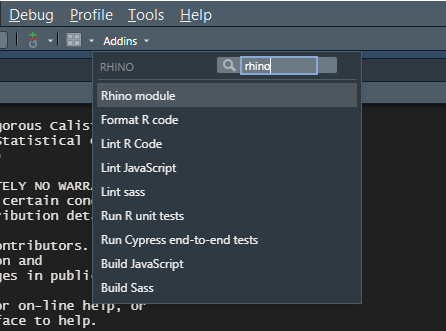

To further streamline your development process, a collection of Add-ins has been designed to integrate with RStudio. These Add-ins provide convenient shortcuts and tools for common tasks.

These Add-ins enhance the RStudio development workflow by providing quick access to essential tasks and enabling background execution, allowing for better transitions between coding and task management.

This guide introduces each Rhino Add-in

# Add-ins

RStudio [add-ins](https://rstudio.github.io/rstudioaddins/) provide a mechanism for executing R functions interactively from within the RStudio ID either through keyboard shortcuts, or through the Add-ins menu

## 1. Create a new rhino Module

-   **Description:** Jump start your module development by creating a new R script document with a Rhino module template. This Add-in sets the foundation for your module structure, letting you dive straight into coding.

## 2. Format R Code

-   **Description:** Uses the `{styler}` package to automatically format R script. This Add-in ensures consistency and readability.

## 3. Lint R Code

-   **Description:** Uses the `{lintr}` package to check all R sources for style errors. Identify and address potential issues in your R scripts with ease.

## 4. Run R Tests

-   **Description:** Uses the `{testhat}` package to run all unit tests in `tests/testthat` directory. Maintain your functions and components reliability.

## 5. Build JavaScript

-   **Description:** Simplify the process of building JavaScript files using Babel and Webpack. Builds the `app/js/index.js` file into `app/static/js/app.min.js`. Choose to watch for changes, automating the build process whenever you save the JavaScript file.

## 6. Build Sass Styles

-   **Description:** Effortlessly build Sass styles using Dart Sass or the `{sass}` R package. It builds the `app/styles/main.scss` file into `app/static/css/app.min.css`. Opt to watch for changes, allowing for automatic rebuilding of style sheets.

## 7. Lint JavaScript

-   **Description:** Runs `ESLint` on the JavaScript sources in the `app/js` directory. It performs linting on JavaScript files with ease. Opt to fix issues automatically for fixing it directly.

## 8. Lint Sass Styles

-   **Description:** Runs `Stylelint` on the Sass sources in the `app/styles` directory. Choose to automatically fix issues to streamline the process of linting Sass styles.

## 9. Run End-to-End Tests

-   **Description:** Execute Cypress end-to-end tests for your application. Choose between interactive and non-interactive modes to validate application behavior.
