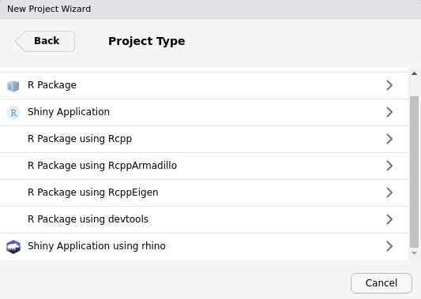
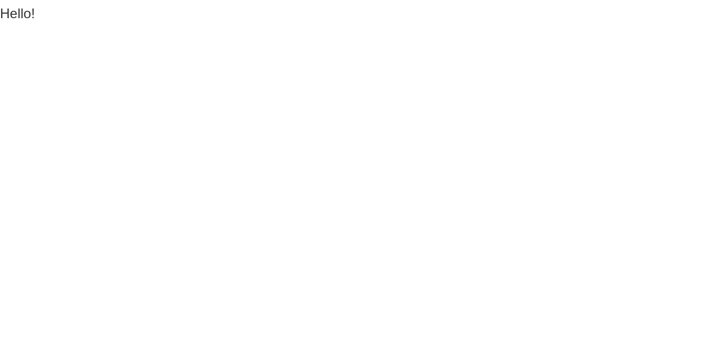
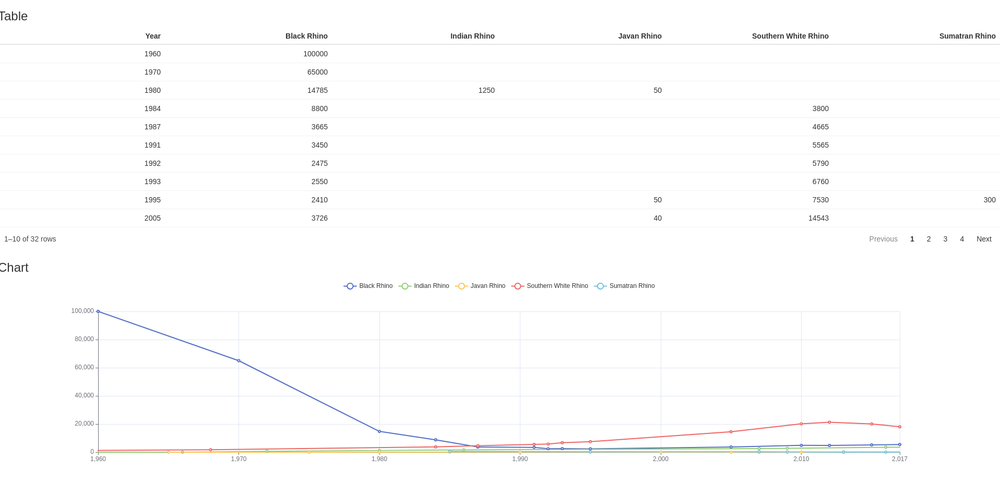

<style>

.app-preview {

  margin: 1.5em 0.75em;
  padding: 0.25em;
  box-shadow:
    0 3.9px 4.6px rgba(0, 0, 0, 0.08),
    0 12.3px 8.4px rgba(0, 0, 0, 0.056),
    0 18.8px 19.2px rgba(0, 0, 0, 0.037),
    0 22px 40px rgba(0, 0, 0, 0.019);

}

</style>


# Setup
  
## How to install Rhino?
  
To get started, the first thing you will need is to install Rhino itself:
  
```r
install.packages("rhino")
```

## Dependencies

Development tools for JavaScript and Sass, provided by Rhino, require
[Node.js](https://nodejs.org/en/) and [yarn](https://yarnpkg.com/).

Please follow installation guides for your OS:
  
* [Node.js installation guide](https://nodejs.org/en/download/)
* [yarn installation guide](https://yarnpkg.com/getting-started/install)

Don't be discouraged if you are not able to get Node.js and yarn on your machine.
Rhino will still work for you (with some small limitations described in
[JavaScript](#add-javascript-code) and [Sass](#add-custom-styles) sections).

__Note:__ _If you already have node installed on your machine, make sure that you are using version >=12.0.0._

----

# Create an initial application

Creating a new Rhino application can be done in two ways -
by running `rhino::init()` function or by using the RStudio Create Project functionality.

## Create an application using the RStudio wizard

If you use RStudio, probably the easiest way to create a new Rhino application is to simply use Create New Project feature. Once Rhino is installed, it will be
automatically added as one of the options in RStudio:

Choose it, input the new project name and you are ready to go.



## Create an application using `rhino::init()`

Creating a Rhino application is possible in the R console by running the `init` function:

```r
rhino::init("RhinoApplication")
```

There are two things you need to know when choosing this way of initializing your application:

1. Rhino will __not__ change your working directory. You need to either
open a new R session in your new application directory or manually change the working directory.
```r
setwd("./RhinoApplication")
```

2. Rhino relies on options added to the projects `.Rprofile` file.
The most robust way to make sure it was correctly sourced is to simply restart the R session.


----

A result of both paths will be an initial Rhino application with the following structure:

```
.
├── app
│   ├── js
│   │   └── index.js
│   ├── logic
│   │   └── __init__.R
│   ├── static
│   │   └── favicon.ico
│   ├── styles
│   │   └── main.scss
│   ├── view
│   │   └── __init__.R
│   └── main.R
├── tests
│   ├── cypress
│   │   └── integration
│   │       └── app.spec.js
│   ├── testthat
│   │   └── test-main.R
│   └── cypress.json
├── app.R
├── RhinoApplication.Rproj
├── dependencies.R
├── renv.lock
└── rhino.yml
```

If you want to know more about it, check [this](https://appsilon.github.io/rhino/articles/rhino-project-structure.html) document.

## Running the application

Now, once you are all set up, let's run it:
  
```r
shiny::shinyAppDir(".")
```

And here is what you should be seeing right now:
  
<div class='app-preview'>
  


</div>


# Add your first module

Your application runs, but it seems to be quite empty. Let's add something there!

## Module structure

In Rhino, each application view is intended to live as a [Shiny module](https://shiny.rstudio.com/articles/modules.html)
and use encapsulation provided by [`box` package](https://klmr.me/box/).

Rhino already created a good place for new modules, the `app/view` directory.
Create a file there, named `chart.R`:

```r
# app/view/chart.R

box::use(
  shiny[moduleServer, NS, h3]
)

#' @export
ui <- function(id) {
  ns <- NS(id)
  
  h3("Chart")
}

#' @export
server <- function(id) {
  moduleServer(id, function(input, output, session) {
    print("Chart module server part works!")
  })
}
```

## Calling a module

The next step is to call your new module in your application.
First, you need to import it into your main application file.
To do that, add another `box::use` section in your `app/main.R` file:
  
```r
# app/main.R

box::use(
  app/view/chart
)

...
```

Now, the main module will be able to use exported functions from `chart.R`.
Let's try it! Modify your `app/main.R` file to look like that:

```r
# app/main.R

box::use(
  shiny[bootstrapPage, moduleServer, NS],
)

box::use(
  app/view/chart
)

#' @export
ui <- function(id) {
  ns <- NS(id)
  bootstrapPage(
    chart$ui(ns("chart"))
  )
}

#' @export
server <- function(id) {
  moduleServer(id, function(input, output, session) {
    chart$server("chart")
  })
}
```

Now, when you run your application, you should see the message from the newly created module:
  


## Adding components to a module

Now is the time to start adding something to your new module. What can we add to a "chart" module?
You're right, a chart. Let's add a chart with a rhinoceros dataset available in Rhino.

### Adding R packages

First, we need to install a library for visualizations - for that, we will go with [`echarts4r`](https://echarts4r.john-coene.com/).

Rhino relies on the [`renv` package](https://rstudio.github.io/renv/index.html) for dependency management.
To add this package to your project, first, you need to install it. We will be using a total of 5 packages for this application. To save us time in the tutorial we will install them all here. Please note that for every new package you add, you will need to install, add to dependencies.R, and re-run renv::snapshot(). 
  
```r
# In R console
renv::install("echarts4r")
renv::install("reactable")
renv::install("tidyr")
renv::install("dplyr")
renv::install("htmlwidgets")
```

__Note:__ _Package `htmlwidgets` is already installed since it is a dependency for `shiny`, but we still should add it to the `dependencies.R` file:_


The second step is to add them to the `dependencies.R` file. This file is a single source of truth when it comes to R packages used by the application. `renv` is going to check dependencies only in this file.

Add `library` calls to it:
  
```r
# dependencies.R

# This file allows packrat (used by rsconnect during deployment) to pick up dependencies.
library(rhino)
library(echarts4r)
library(reactable)
library(tidyr)
library(dplyr)
library(htmlwidgets)
```

Finally, you need to update your `renv.lock` file:
  
```r
# in R console
renv::snapshot()
```

If you check the `renv.lock` file, you will see that it was updated with `echarts4r` and all its dependencies.

### Add dependencies to the module

Now, once you have both packages available in your project environment, it's time to use them.
First, you need to import them into your module. Extend `box::use` call in your
`app/view/chart.R` file:

```r
# app/view/chart.R

box::use(
  shiny[moduleServer, NS, h3, tagList],
  echarts4r,
)

...
```

You can use those packages in your module by calling `{package}${function}`. For more
options of importing in `box` check [this](https://klmr.me/box/index.html#loading-code) link.


Add `echarts4r` render to the server part of the module and output part to its UI:

```r
# app/view/chart.R

box::use(
  shiny[moduleServer, NS, h3, tagList],
  echarts4r,
)

#' @export
ui <- function(id) {
  ns <- NS(id)
  
  tagList(
    h3("Chart"),
    echarts4r$echarts4rOutput(ns("chart"))
  )
}

#' @export
server <- function(id) {
  moduleServer(id, function(input, output, session) {
    output$chart <- echarts4r$renderEcharts4r(
      # Datasets are the only case when you need to use :: in `box`.
      # This issue should be solved in the next `box` release.
      rhino::rhinos |>
        echarts4r$group_by(Species) |>
        echarts4r$e_chart(x = Year) |>
        echarts4r$e_line(Population) |>
        echarts4r$e_x_axis(Year) |>
        echarts4r$e_tooltip()
    )
  })
}
```

One thing worth noting here is that in the UI part we had to use another function
from Shiny - `tagList`. To be able to do that, you have to adjust your import
in `box::use` - simply add `tagList` to the list of imported functions.

----
  
Finally, when you run your application, you should see something similar to this:
  
<div class='app-preview'>


</div>

# Add a second module

Once you have some content presented in the application, it would be great to
add a table to show the dataset.

For that, let's create another module - `app/view/table.R`:

```r
# app/view/table.R

box::use(
  shiny[moduleServer, NS, h3, tagList],
)

#' @export
ui <- function(id) {
  ns <- NS(id)
  
  tagList(
    h3("Table")
  )
}

#' @export
server <- function(id) {
  moduleServer(id, function(input, output, session) {
    
  })
}
```

## Calling the second module

As we did before, we need to call the new module in the `main.R` file:

```r
# app/main.R

box::use(
  shiny[bootstrapPage, moduleServer, NS],
)

box::use(
  app/view/chart,
  app/view/table
)

#' @export
ui <- function(id) {
  ns <- NS(id)
  
  bootstrapPage(
    table$ui(ns("table")),
    chart$ui(ns("chart"))
  )
}

#' @export
server <- function(id) {
  moduleServer(id, function(input, output, session) {
    table$server("table")
    chart$server("chart")
  })
}
```

## Use the same dataset for both modules

We want to use the same dataset in both modules, so instead of calling it
twice, let's pass data as an argument:

```r
# app/main.R

box::use(
  shiny[bootstrapPage, moduleServer, NS]
)

box::use(
  app/view/table,
  app/view/chart,
)

#' @export
ui <- function(id) {
  ns <- NS(id)
  
  bootstrapPage(
    table$ui(ns("table")),
    chart$ui(ns("chart"))
  )
}

#' @export
server <- function(id) {
  moduleServer(id, function(input, output, session) {
    # Datasets are the only case when you need to use :: in `box`.
    # This issue should be solved in the next `box` release.
    data <- rhino::rhinos
    
    table$server("table", data = data)
    chart$server("chart", data = data)
  })
}
```

```r
# app/view/table.R

box::use(
  shiny[moduleServer, NS, h3, tagList],
)

#' @export
ui <- function(id) {
  ns <- NS(id)
  
  tagList(
    h3("Table")
  )
}

#' @export
server <- function(id, data) {
  moduleServer(id, function(input, output, session) {
    
  })
}
```

```r
# app/view/chart.R

box::use(
  shiny[moduleServer, NS, h3, tagList],
  echarts4r
)

#' @export
ui <- function(id) {
  ns <- NS(id)
  
  tagList(
    h3("Chart"),
    echarts4r$echarts4rOutput(ns("chart"))
  )
}

#' @export
server <- function(id, data) {
  moduleServer(id, function(input, output, session) {
    output$chart <- echarts4r$renderEcharts4r(
      data |>
        echarts4r$group_by(Species) |>
        echarts4r$e_chart(x = Year) |>
        echarts4r$e_line(Population) |>
        echarts4r$e_x_axis(Year) |>
        echarts4r$e_tooltip()
    )
  })
}
```

## Create a table

For the table, we will go with the [`reactable`](https://glin.github.io/reactable/) package.

Now you can add a table to the application. Let's check the raw data for Rhinos:

```r
# app/view/table.R

box::use(
  shiny[moduleServer, NS, h3, tagList],
  reactable,
)

#' @export
ui <- function(id) {
  ns <- NS(id)
  
  tagList(
    h3("Table"),
    reactable$reactableOutput(ns("table"))
  )
}

#' @export
server <- function(id, data) {
  moduleServer(id, function(input, output, session) {
    output$table <- reactable$renderReactable(
      reactable$reactable(data)
    )
  })
}
```

The application should look similar to this:
  
<div class='app-preview'>


</div>

# Add logic

It seems that it would be great to slightly adjust the table. Let's transform the dataset a little bit.

We recommend placing the code which can be expressed without Shiny in the `app/logic` directory.

Let's create a file there, called `app/logic/data_transformation.R`.

The table would be better if for each Rhino species we would have a separate column,
so it would be easy to compare populations across time. To do that, we need to transform the dataset using the `pivot_wider` function from the `tidyr` package. 

Now we are able to access this function in our `data_transformation.R` file using box::use(). Let's also create a function that wraps `pivot_wider` and transforms data. Note that, as always, we need to add @export to be able to access it in the file it is being sourced. 

```r
# app/logic/data_transformation.R

box::use(
  tidyr[pivot_wider]
)

#' @export
transform_data <- function(data) {
  pivot_wider(
    data = data,
    names_from = Species,
    values_from = Population
  )
}
```

The next step is to call this function in your table module.

Add box import and transform dataset:
  
```r
# app/view/table.R

box::use(
  shiny[moduleServer, NS, h3, tagList],
  reactable,
)

box::use(
  app/logic/data_transformation[transform_data]
)

#' @export
ui <- function(id) {
  ns <- NS(id)
  
  tagList(
    h3("Table"),
    reactable$reactableOutput(ns("table"))
  )
}

#' @export
server <- function(id, data) {
  moduleServer(id, function(input, output, session) {
    output$table <- reactable$renderReactable(
      data |>
        transform_data() |>
        reactable$reactable()
    )
  })
}
```

When you run the application, you should see something similar to this:

<div class='app-preview'>



</div>

You can notice, that table is arranged by the Black Rhino population.
It would make sense to change it to Year using `dplyr::arrange`.

Next, add arrange to `transform_data` function:
  
```r
# app/logic/data_transformation.R

box::use(
  tidyr[pivot_wider],
  dplyr[arrange]
)

#' @export
transform_data <- function(data) {
  pivot_wider(
    data = data,
    names_from = Species,
    values_from = Population
  ) |>
    arrange(Year)
}

```

The result looks much more understandable:

<div class='app-preview'>


</div>

There is still one element that can be improved. If you check the X-axis in the chart,
values contain a comma. It's the default behavior for integers, but this is a year!
To fix that, you need to add a custom formatter. Let's create another file, `app/logic/chart_utils.R`:
  
```r
# app/logic/chart_utils.R

box::use(
  htmlwidgets[JS]
)

#' @export
label_formatter <- JS(
  "function(value, index){
    return value;
  }"
)
```


Finally, add the formatter to the chart module:
  
```r
# app/view/chart.R

box::use(
  shiny[moduleServer, NS, h3, tagList],
  echarts4r
)

box::use(
  app/logic/chart_utils[label_formatter]
)

#' @export
ui <- function(id) {
  ns <- NS(id)
  
  tagList(
    h3("Chart"),
    echarts4r$echarts4rOutput(ns("chart"))
  )
}

#' @export
server <- function(id, data) {
  moduleServer(id, function(input, output, session) {
    output$chart <- echarts4r$renderEcharts4r(
      data |>
        echarts4r$group_by(Species) |>
        echarts4r$e_chart(x = Year) |>
        echarts4r$e_line(Population) |>
        echarts4r$e_x_axis(
          Year,
          axisLabel = list(
            formatter = label_formatter
          )
        ) |>
        echarts4r$e_tooltip()
    )
  })
}
```

It should now look better:

<div class='app-preview'>


</div>

# Add custom styles

__Note:__ _Sass builder uses Node.js. If you are not able to install Node in your environment, you can change the `sass` entry in the `rhino.yml` file to `r`. It will now use the R package for Sass bundling. Under the hood, it uses a deprecated C++ library, so the Node solution is strongly recommended here._

In this stage, the application has working components, but it does not look well.

Adjusting application style can be done by providing custom styles in the `app/styles` directory,
But first, you need to adjust the application a little bit by adding Html tags and CSS classes:
  
```r
# app/main.R

box::use(
  shiny[bootstrapPage, moduleServer, NS, div],
)

box::use(
  app/view/table,
  app/view/chart,
)

#' @export
ui <- function(id) {
  ns <- NS(id)
  
  bootstrapPage(
    div(
      class = "components-container",
      table$ui(ns("table")),
      chart$ui(ns("chart"))
    )
  )
}

#' @export
server <- function(id) {
  moduleServer(id, function(input, output, session) {
    # Datasets are the only case when you need to use :: in `box`.
    # This issue should be solved in the next `box` release.
    data <- rhino::rhinos
    
    table$server("table", data = data)
    chart$server("chart", data = data)
  })
}
```

```r
# app/view/chart.R

box::use(
  shiny[moduleServer, NS, div],
  echarts4r
)

box::use(
  app/logic/chart_utils[label_formatter]
)

#' @export
ui <- function(id) {
  ns <- NS(id)
  
  div(
    class = "component-box",
    echarts4r$echarts4rOutput(ns("chart"))
  )
}

#' @export
server <- function(id, data) {
  moduleServer(id, function(input, output, session) {
    output$chart <- echarts4r$renderEcharts4r(
      data |>
        echarts4r$group_by(Species) |>
        echarts4r$e_chart(x = Year) |>
        echarts4r$e_line(Population) |>
        echarts4r$e_x_axis(
          Year,
          axisLabel = list(
            formatter = label_formatter
          )
        ) |>
        echarts4r$e_tooltip()
    )
  })
}
```

```r
# app/view/table.R

box::use(
  shiny[moduleServer, NS, div],
  reactable,
)

box::use(
  app/logic/data_transformation[transform_data]
)

#' @export
ui <- function(id) {
  ns <- NS(id)
  
  div(
    class = "component-box",
    reactable$reactableOutput(ns("table"))
  )
}

#' @export
server <- function(id, data) {
  moduleServer(id, function(input, output, session) {
    output$table <- reactable$renderReactable(
      data |>
        transform_data() |>
        reactable$reactable()
    )
  })
}
```

Now you are ready to modify the styles. Simply add few CSS rules to `app/styles/mains.scss` file:
  
```css
// app/styles/main.scss

.components-container {
  display: inline-grid;
  grid-template-columns: 1fr 1fr;
  width: 100%;
  
  .component-box {
    padding: 10px;
    margin: 10px;
    box-shadow: 0 4px 8px 0 rgba(0, 0, 0, 0.2), 0 6px 20px 0 rgba(0, 0, 0, 0.19);
  }
}
```

If you try running the application right now, you will not see any changes.
That is because Rhino uses minified `app/static/app.min.css` for styling.
To use it, you will need to build it using the Rhino function:
  
```r
# in R console
rhino::build_sass()
```

Now, after running the application you should see something similar to this:

<div class='app-preview'>


</div>

It is worth noting, that you don't need to add `app/static/app.min.css` to
your application header - Rhino does that for you.

Let's adjust the application a little bit more by adding a title:
  
```r
# app/main.R

box::use(
  shiny[bootstrapPage, moduleServer, NS, div, h1],
)

box::use(
  app/view/table,
  app/view/chart,
)

#' @export
ui <- function(id) {
  ns <- NS(id)
  
  bootstrapPage(
    h1("RhinoApplication"),
    div(
      class = "components-container",
      table$ui(ns("table")),
      chart$ui(ns("chart"))
    )
  )
}

...
```

And some styling:

```css
// app/styles/main.scss

.components-container {
  display: inline-grid;
  grid-template-columns: 1fr 1fr;
  width: 100%;
  
  .component-box {
    padding: 10px;
    margin: 10px;
    box-shadow: 0 4px 8px 0 rgba(0, 0, 0, 0.2), 0 6px 20px 0 rgba(0, 0, 0, 0.19);
  }
}

h1 {
  text-align: center;
  font-weight: 900;
}
```

Finally, build Sass once again:
  
```r
# in R console
rhino::build_sass()
```

The result should look similar to this:

<div class='app-preview'>


</div>

----
  
  
  
  
# Add JavaScript code

----
  
__Note:__ _Rhino tools for JS require Node.js. You can still use JavaScript code [like in a regular Shiny application](https://shiny.rstudio.com/articles/packaging-javascript.html), but instead of using `www` directory, you should add your files to `static/js` and call them using full path, e.g. `tags$script(src = "static/js/app.min.js")`._

----
  
As the last element, let's add a button that will trigger a JavaScript popup.

First, we need to create a simple button and style it:

```r
# app/main.R

box::use(
  shiny[bootstrapPage, moduleServer, NS, div, h1, tags, icon],
)

box::use(
  app/view/table,
  app/view/chart,
)

#' @export
ui <- function(id) {
  ns <- NS(id)
  
  bootstrapPage(
    h1("RhinoApplication"),
    div(
      class = "components-container",
      table$ui(ns("table")),
      chart$ui(ns("chart"))
    ),
    tags$button(
      id = "help-button",
      icon("question")
    )
  )
}

...
```

```css
// app/styles/main.scss

.components-container {
  display: inline-grid;
  grid-template-columns: 1fr 1fr;
  width: 100%;
  
  .component-box {
    padding: 10px;
    margin: 10px;
    box-shadow: 0 4px 8px 0 rgba(0, 0, 0, 0.2), 0 6px 20px 0 rgba(0, 0, 0, 0.19);
  }
}

h1 {
  text-align: center;
  font-weight: 900;
}

#help-button {
  position: fixed;
  top: 0;
  right: 0;
  margin: 10px;
}
```

Remember to rebuild Sass with `rhino::build_sass()`!
  
You should now see a button with a question mark in the top right corner of the application:

<div class='app-preview'>


</div>

Now, it's time for writing the JavaScript code that should show the popup with a message.
All JS code should be stored in the `app/js` directory. You already have the first (empty)
file there - `index.js`. Let's use it:
  
```js
// app/js/index.js

export function showHelp() {
  alert("Check rhino here: https://appsilon.github.io/rhino/");
}
```

This function will simply show a browser alert with the message. If you are familiar with how JavaScript code is used in Shiny applications, you will notice one difference - keyword `export` added before the function name. In Rhino, only functions marked like that will be available for Shiny to use.

Same as it was with styles, the Rhino application does not use JS files directly,
but instead utilizes minified version build with `rhino::build_js` function.
Try it:
  
```r
# in R console
rhino::build_js()
```

Now `app/static/js/app.min.js` file has been created and, same as the minified CSS file, is automatically included in the application head tag.

The last thing here is to use the `showHelp()` function in the application. To do that, let's simply add `onclick` to the button:

```r
# app/main.R

box::use(
  shiny[bootstrapPage, moduleServer, NS, div, h1, tags, icon],
)

box::use(
  app/view/table,
  app/view/chart,
)

#' @export
ui <- function(id) {
  ns <- NS(id)
  
  bootstrapPage(
    h1("RhinoApplication"),
    div(
      class = "components-container",
      table$ui(ns("table")),
      chart$ui(ns("chart"))
    ),
    tags$button(
      id = "help-button",
      icon("question"),
      onclick = "App.showHelp()"
    )
  )
}

...
```

You have probably noticed the second difference between the classic Shiny approach and the one used in Rhino. All exported JS functions are now available under `App` (same as any other JavaScript function from a library, e.g. `Math.round`).

Now, if you run the application and click the button, you should see something like this:

<div class='app-preview'>


</div>

----
  
__Congratulations! You now have a fully armed and operational ~~battle station~~ Rhino application!__
