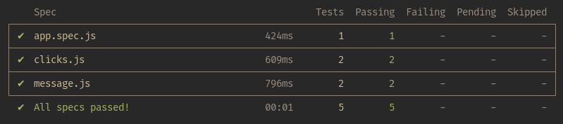
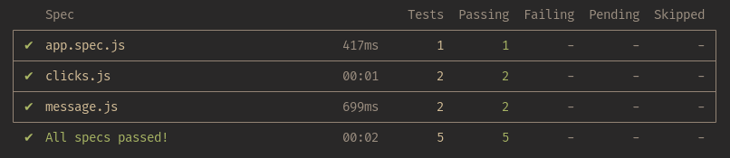
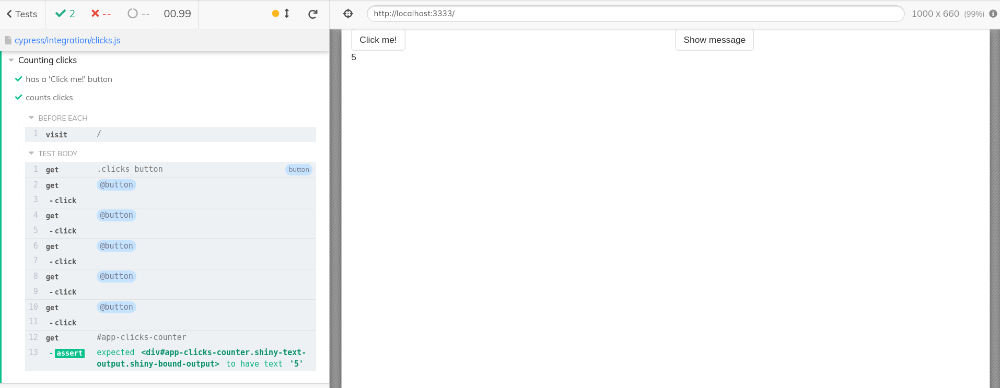

In this tutorial, we will write tests that are going to check
the behavior of a running Rhino application using [Cypress](https://www.cypress.io/).

# Setup

## Dependencies

Before going further, you need to install:

1. `rhino` (surprised?) - `install.packages("rhino")`
2. Node.js - follow [instructions for your Operating System](https://nodejs.org/en/download/)

## Test application

First, we need to build a simple Rhino application
that is going to serve as a playground for our tests.

To do that, create a new project using either RStudio wizard or
`rhino::init("EndToEndTests")` function. For more details, check
[Create an initial application](https://appsilon.github.io/rhino/articles/tutorial/create-your-first-rhino-app.html#create-an-initial-application)
section in the basic Rhino tutorial.

Once you have the initial application, let's add some content that we can test.
Create two modules in `app/view` directory:

##### `app/view/clicks.R`

```r
# app/view/clicks.R

box::use(
  shiny[actionButton, div, moduleServer, NS, renderText, textOutput],
)

#' @export
ui <- function(id) {
  ns <- NS(id)
  div(
    class = "clicks",
    actionButton(
      ns("click"),
      "Click me!"
    ),
    textOutput(ns("counter"))
  )
}

#' @export
server <- function(id) {
  moduleServer(id, function(input, output, session) {
    output$counter <- renderText(input$click)
  })
}
```

##### `app/view/message.R`

```r
# app/view/message.R

box::use(
  shiny[actionButton, div, moduleServer, NS, renderText, req, textOutput],
)

#' @export
ui <- function(id) {
  ns <- NS(id)

  div(
    class = "message",
    actionButton(
      ns("show_message"),
      "Show message"
    ),
    textOutput(ns("message_text"))
  )
}

#' @export
server <- function(id) {
  moduleServer(id, function(input, output, session) {
    output$message_text <- renderText({
      req(input$show_message)

      "This is a message"
    })
  })
}
```

Now, we need to add those modules to `app/main.R`:

##### `app/main.R`

```r
# app/main.R

box::use(
  shiny[column, fluidPage, fluidRow, moduleServer, NS],
)

box::use(
  app/view/clicks,
  app/view/message,
)


#' @export
ui <- function(id) {
  ns <- NS(id)
  fluidPage(
    fluidRow(
      column(
        width = 6,
        clicks$ui(ns("clicks"))
      ),
      column(
        width = 6,
        message$ui(ns("message"))
      )
    )
  )
}

#' @export
server <- function(id) {
  moduleServer(id, function(input, output, session) {
    clicks$server("clicks")
    message$server("message")
  })
}
```

If you now run the application, you should see something similar to this:


There are two functionalities that we are going to test:

1. We will check if the message is shown after clicking the button.
2. We will check if the application counts button clicks correctly.

# How to run Cypress tests?

If you check the project structure, you will find `tests/cypress/` directory
with an initial test in `tests/cypress/integration/app.spec.js` ready to use.

It contains a simple test that just starts the application.
If your app can start, it will pass, no matter if it crushes a few seconds later.

Now, if you call `rhino::test_e2e()` the test will be run, but before that, since this is
the first time you use one of the functionalities that depend on Node.js, it needs
to install all the required libraries. Don't worry, this is just a one-time step
and is done automatically.

Once everything is installed, you will see the output of the test:


There is one more thing worth noticing. End-to-end tests have an interactive mode,
where you can see Cypress interacting with your application.
To use it, simply run tests with one additional argument: `rhino::test_e2e(interactive = TRUE)`
Since we have just one simple test, there will be not much there, but soon this will change.

# Test the message functionality message

We are about to write our first end-to-end test. The goal is to check if
clicking the button with "Show message" label will show the message.

## Test file structure

The first thing to do is to create a test file: `tests/cypress/integration/message.js`.

Inside, provide a structure and description for tests using `describe` and `it`:

```js
// tests/cypress/integration/message.js

describe("Show message", () => {
  it("'Show message' button exists", () => {

  });

  it("'Show message' button shows the message", () => {

  });
});

```

As you can see, we are going to write two tests - the first one to check if the button exists
and the second to check if it works properly and shows the message.

Now, let's make sure that in the beginning, Cypress will open the application.
To achieve that, add `beforeEach` statement at the beginning:

```js
// tests/cypress/integration/message.js

describe("Show message", () => {
  beforeEach(() => {
    cy.visit("/");
  });

  it("'Show message' button exists", () => {

  });

  it("'Show message' button shows the message'", () => {

  });
});

```

Now before each test (each `it`) Cypress will go to the application root URL.
Note that you don't need to provide the full address - it is already preconfigured
and you don't need to worry about it.

## Test if the button exists

The test is going to use two Cypress commands - `get` and `should`.
The first one will look for an element using a given CSS selector and
the second will check if the selected element has the expected property.

First, we need to build a CSS selector that will point Cypress to the correct button.
This can be done using the part of the browser Developer Tools, usually called
(depending on which browser you use) Inspector, Explorer, or Elements.
You can learn more about Developer Tools available in your browser for example from
[this article](https://developer.mozilla.org/en-US/docs/Learn/Common_questions/What_are_browser_developer_tools).

Now, run the application (`shiny::runApp()` in the R console or a button in RStudio),
open it in the browser, right-click on the "Show message" button, and select Inspect.
Now you should be able to see the HTML structure of the webpage with the button highlighted.
From this view, you can see that we can ask for example for a `button` (HTML tag)
inside an element of class `message`. Let's pass this selector to Cypress `get` command:

```js
// tests/cypress/integration/message.js

describe("Show message", () => {
  beforeEach(() => {
    cy.visit("/");
  });

  it("'Show message' button exists", () => {
    cy.get(".message button");
  });

  it("'Show message' button shows the message'", () => {

  });
});

```

The next step is to check if this button has a proper label:

```js
// tests/cypress/integration/message.js

describe("Show message", () => {
  beforeEach(() => {
    cy.visit("/");
  });

  it("'Show message' button exists", () => {
    cy.get(".message button").should("have.text", "Show message");
  });

  it("'Show message' button shows the message'", () => {

  });
});

```

If you run tests (`rhino::test_e2e()`), you will see that it passes - the button is there:


## Test if the button shows the message

Ok, we are sure that the button exists, now it's time to click it and check the outcome.
Cypress comes with a command called `click` (who would expect that?!).
Use it in the second test to click the button:

```js
// tests/cypress/integration/message.js

describe("Show message", () => {
  beforeEach(() => {
    cy.visit("/");
  });

  it("'Show message' button exists", () => {
    cy.get(".message button").should("have.text", "Show message");
  });

  it("'Show message' button shows the message'", () => {
    cy.get(".message button").click();
  });
});

```

Now, we just need to check if the message is there and has proper content.
We will do it the same as we did with the button - we will look for it using
the CSS selector and check if it contains the expected text.
This time we will use the id. If you check the element in the browser
(the same way as we did with the button), you will see that
the id of the message is "app-message-message_text". This shows, that in Rhino,
everything is a Shiny module, even the outermost UI and server part.
"app" in this selector is the namespace that identifies this outer module.
"message" is the namespace part added when we called our `message.R` module
and "message_text" is the id of our `textOutput`.

Ok, let's use it and check if the message element has a correct text inside:

```js
// tests/cypress/integration/message.js

describe("Show message", () => {
  beforeEach(() => {
    cy.visit("/");
  });

  it("'Show message' button exists", () => {
    cy.get(".message button").should("have.text", "Show message");
  });

  it("'Show message' button shows the message'", () => {
    cy.get(".message button").click();

    cy.get("#app-message-message_text").should("have.text", "This is a message");
  });
});

```

Run tests again and you should see that again, all passed:


# Test counting clicks functionality

As previously, we need to start with creating a file and providing the test structure.
Create `tests/cypress/integration/clicks.js` and fill it with the skeleton
similar to the first test file:

```js
// tests/cypress/integration/clicks.js

describe("Counting clicks", () => {
  beforeEach(() => {
    cy.visit("/");
  });

  it("has a 'Click me!' button", () => {

  });

  it("counts clicks", () => {

  });
});
```

## Test if the button exists

First, we want to make sure the button exists. We will follow the example from
the message module:

```js
// tests/cypress/integration/clicks.js

describe("Counting clicks", () => {
  beforeEach(() => {
    cy.visit("/");
  });

  it("has a 'Click me!' button", () => {
    cy.get(".clicks button").should("have.text", "Click me!");
  });

  it("counts clicks", () => {

  });
});
```

Now, if you run tests, you will see the new ones. And they should pass.



## Test if clicks are counted correctly

The next step is to check if clicking the button affects the counter
and if it shows the correct value. To do that, we will simulate 5 clicks
and check if the counter is set to 5.

Since the button will be clicked several times, we need to assign it to a variable.
To do that, we will use another Cypress command: `as`:

```js
// tests/cypress/integration/clicks.js

describe("Counting clicks", () => {
  beforeEach(() => {
    cy.visit("/");
  });

  it("has a 'Click me!' button", () => {
    cy.get(".clicks button").should("have.text", "Click me!");
  });

  it("counts clicks", () => {
    cy.get(".clicks button").as("button");
  });
});
```

Now, we can access the button using `@button`. So let's click it 5 times:

```js
// tests/cypress/integration/clicks.js

describe("Counting clicks", () => {
  beforeEach(() => {
    cy.visit("/");
  });

  it("has a 'Click me!' button", () => {
    cy.get(".clicks button").should("have.text", "Click me!");
  });

  it("counts clicks", () => {
    cy.get(".clicks button").as("button");

    for (let i = 0; i < 5; i++) {
      cy.get("@button").click();
    }
  });
});
```

Finally, we need to check if the counter has the correct value
(you already know how to look for its id to pass to `get` command):

```js
// tests/cypress/integration/clicks.js

describe("Counting clicks", () => {
  beforeEach(() => {
    cy.visit("/");
  });

  it("has a 'Click me!' button", () => {
    cy.get(".clicks button").should("have.text", "Click me!");
  });

  it("counts clicks", () => {
    cy.get(".clicks button").as("button");

    for (let i = 0; i < 5; i++) {
      cy.get("@button").click();
    }

    cy.get("#app-clicks-counter").should("have.text", "5");
  });
});
```

Now, run your tests. You should see something similar to this
(you might have noticed that now clicking test took more time than previously -
that's because the clicking finally happened):



If you run tests using the interactive mode (`rhino::test_e2e(interactive = TRUE)`), you will be able to
check each click as a separate action!



# What happens when the app changes?

Let's now think about a scenario, when, during the development of the application
some new feature has been introduced. This feature works fine, but unfortunately,
it introduced some unexpected changes to other features.

We will simulate this by a small modification in the `app/view/clicks.R`:

```r
# app/view/clicks.R

box::use(
  shiny[actionButton, div, moduleServer, NS, renderText, textOutput],
)

#' @export
ui <- function(id) {
  ns <- NS(id)
  div(
    class = "clicks",
    actionButton(
      ns("click"),
      "Click me!"
    ),
    textOutput(ns("counter"))
  )
}

#' @export
server <- function(id) {
  moduleServer(id, function(input, output, session) {
    output$counter <- renderText(input$click + 1)
  })
}
```

If you now run tests, you will see that the counting one failed:


This way we spotted the (unexpected) change in the application behavior
in an automated way. Without end-to-end tests, this could go
unnoticed, since the app still works - there are no errors, it
is just the logic that has been changed in a way we didn't want it to be modified.

# Continuous Integration

But here comes a question: __Do you need to run those tests each time you make a change?__

Fortunately, this can be automated! Rhino comes with a setup for
[GitHub Actions](https://github.com/features/actions) will run those tests for you and inform you
if there is a problem. You can even block merging changes that
don't pass those automated checks.

What do you need to do to get all of this?
If you are using GitHub - literally nothing! Your Rhino application
comes with a GitHub Actions configuration (`.github/workflows/rhino-test.yml`)
that includes end-to-end tests!


# Summary

Adding end-to-end tests to your application can ensure the quality and
help catch bugs early in the process of development.
Rhino comes with a powerful setup that utilizes [Cypress](https://www.cypress.io/) to check
the behavior of your application.

But what if you want to use another solution: `shinytest2`?

You can do that without any problems, `shinytest2` works out of the box in Rhino applications!
You can learn more [here](https://appsilon.github.io/rhino/articles/how-to/use-shinytest2.html).

And if you want to learn about the differences between Cypress and `shinytest2`,
check [this blogpost](https://appsilon.com/shinytest2-vs-cypress-e2e-testing/).
